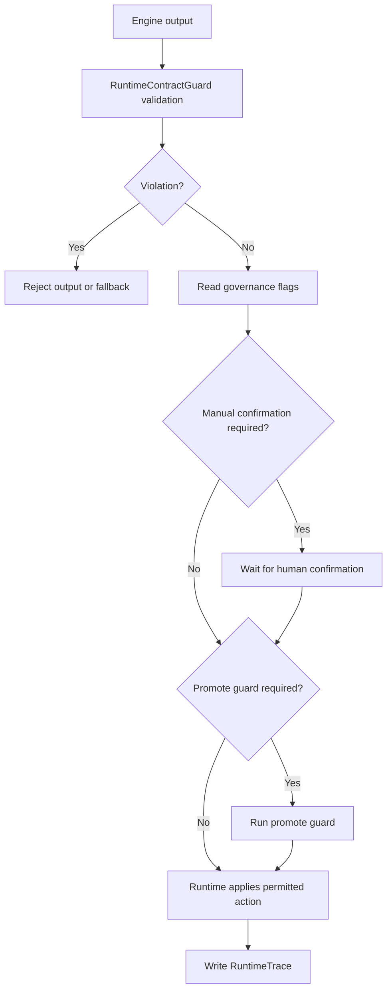

# 治理与校验流程

运行时契约的核心约束是：引擎可以判断，运行时负责治理。本文档说明引擎输出从产生到进入 trace 的校验流程。

## 输出类型

引擎输出分为两类：

- `EngineDecision`：表达一次判断结果，例如投影决策、波传播决策、偏置决策。
- `EngineProposal`：表达一次变更建议，例如突触调整建议、学习假设建议。

两者都必须包含：

- 引擎身份。
- 输入快照哈希。
- 决策或建议标识。
- 原因码。
- 置信度。
- 治理标记。

## 默认治理规则

`RuntimeGovernanceFlags` 的默认值是保守的：

```csharp
RequiresGovernanceReview = true
TraceRequired = true
PromotesStableNeuron = false
PromotesStableSynapse = false
FallbackSafe = true
```

这意味着引擎默认不能静默执行，也不能绕过 trace。

## 决策校验

`RuntimeContractGuard.ValidateDecision` 校验：

- 输出中不能包含禁止字段。
- `RequiresGovernanceReview` 必须保持开启。
- `TraceRequired` 必须保持开启。

禁止字段包括：

- `executed`
- `persisted`
- `governance_bypassed`
- `manual_confirmation_bypassed`
- `stable_state_mutated`

这些字段即使只是以 JSON 文本形式出现，也会被视为越界信号，因为它们暗示引擎越过了运行时职责。

## 建议校验

`RuntimeContractGuard.ValidateProposal` 校验：

- 输出中不能包含禁止字段。
- 如果建议提升稳定神经元或稳定突触，则必须同时要求治理审核和 promote guard。

稳定提升必须满足：

1. 运行时治理审核。
2. promote guard 校验。
3. 必要时人工确认。
4. trace 记录。
5. 运行时自身执行最终写入。

## Trace 校验

`RuntimeContractGuard.ValidateTrace` 校验公开 trace 是否泄露敏感内容。

禁止出现在 trace 中的内容包括：

- `private_parameters`
- `internal_test_vectors`
- `private_samples`
- `secret`
- `connection_string`
- `api_key`

Trace 的目的不是复现闭源引擎内部计算，而是给运行时决策链提供可公开审计的依据。

## 插件握手校验

`RuntimeContractGuard.ValidatePluginHandshake` 校验：

- 插件必须保留真实引擎身份。
- 插件不能声明可替代运行时治理。
- 插件清单中的能力身份必须和实际引擎身份一致。
- 插件执行超时必须大于零。

如果插件隐藏身份或声明替代治理，运行时应拒绝该插件。

## 依赖边界校验

`RuntimeContractGuard.ValidateDependencyBoundary` 用于确认契约类库没有引入载体、数据访问和企业实现依赖。

禁止依赖包括：

- `Air.Cloud`
- Entity Framework
- `Npgsql`
- `Dapper`
- `SqlSugar`
- `AirMeta.SelfWeave.Repository`
- `AirMeta.SelfWeave.Domain`
- `AirMeta.SelfWeave.Service`
- `AirMeta.SelfWeave.Entry`

## 治理结果

运行时治理输出 `GovernanceResult`。常见结果：

- `Pending`
- `Approved`
- `Rejected`
- `ManualConfirmationRequired`
- `PromoteGuardRequired`
- `FallbackApplied`

该结果由运行时生成，不应由引擎生成或替代。

## 最小安全流程


