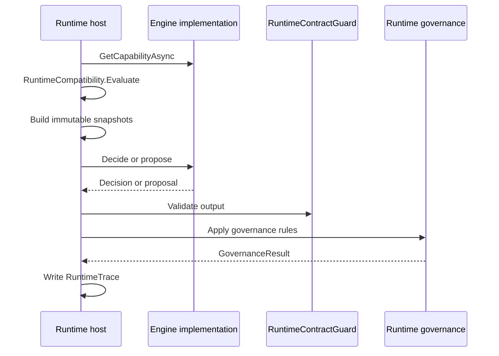

# Runtime 接入指南

本文档说明 API、运行时宿主、社区引擎、闭源认知引擎或插件如何接入 `AirMeta.SelfWeave.Runtime`。

## 接入方角色

### Runtime host

运行时宿主负责：

- 构造不可变快照。
- 选择引擎实现。
- 获取并校验引擎能力。
- 调用引擎接口。
- 校验引擎输出。
- 执行治理、人工确认、promote guard 和 fallback。
- 写入 trace 和稳定状态。

### Engine

引擎负责：

- 实现一个或多个引擎接口。
- 返回能力声明。
- 读取运行时快照。
- 返回决策或建议。
- 提供原因码和置信度。

引擎不负责：

- 数据库写入。
- 运行时生命周期推进。
- 权限判定。
- 治理批准。
- 人工确认。
- 稳定图谱直接变更。

### Plugin adapter

插件适配器负责把进程内、进程外或远程引擎包装为固定入口。插件也必须返回能力声明和实际引擎身份。

## 推荐接入流程



## 实现投影引擎

投影引擎实现 `IProjectionDecisionEngine`：

```csharp
public sealed class CommunityProjectionEngine : IProjectionDecisionEngine
{
    public ValueTask<EngineCapability> GetCapabilityAsync(CancellationToken cancellationToken = default)
    {
        var capability = new EngineCapability(
            "community-projection",
            "Community Projection Engine",
            "1.0.0",
            RuntimeContractVersions.Initial,
            [RuntimeContractKind.ProjectionDecision],
            [RuntimeContractVersions.Initial],
            [RuntimeContractVersions.Initial],
            TimeSpan.FromSeconds(2),
            FallbackRequired: false,
            DeterminismLevel.Deterministic,
            TraceDisclosureLevel.PublicAudit);

        return ValueTask.FromResult(capability);
    }

    public ValueTask<ProjectionDecision> DecideProjectionAsync(
        ProjectionInputSnapshot projection,
        CognitiveContextSnapshot context,
        CancellationToken cancellationToken = default)
    {
        var decision = new ProjectionDecision(
            RuntimeContractIdentity.Unspecified,
            "decision-1",
            projection.SnapshotHash,
            ["projection_rule_matched"],
            0.80m,
            new RuntimeGovernanceFlags(),
            projection.CandidateNodeRefs,
            projection.CandidateRelationRefs);

        return ValueTask.FromResult(decision);
    }
}
```

示例只说明契约形态。真实实现应提供稳定的 `RuntimeContractIdentity`，并让运行时写入真实 trace。

## 运行时调用要求

运行时调用前应完成：

1. 读取 `EngineCapability`。
2. 使用 `RuntimeCompatibility.Evaluate` 校验契约类型、快照版本、决策版本和超时限制。
3. 构造不可变快照，并计算 `SnapshotHash`。
4. 调用引擎接口。
5. 使用 `RuntimeContractGuard` 校验决策、建议或 trace。
6. 根据 `RuntimeGovernanceFlags` 执行治理。
7. 写入 `RuntimeTrace`。

## 错误处理建议

运行时遇到以下情况应拒绝调用或进入 fallback：

- `IncompatibleContract`
- `UnsupportedSnapshot`
- `UnsupportedDecision`
- `TimeoutRequired`
- 插件握手身份不一致。
- 插件声明可替代运行时治理。
- 输出包含 `executed`、`persisted`、`governance_bypassed`、`stable_state_mutated` 等禁止字段。

运行时遇到以下情况可以调用但应增强审计：

- `FallbackRequired`
- `TraceLimited`
- `RequiresManualConfirmation = true`
- `RequiresPromoteGuard = true`
- `AffectsLongTermState = true`
- `AffectsHighRiskAction = true`

## 包引用方式

项目引用示例：

```xml
<ProjectReference Include="..\..\Runtime\AirMeta.SelfWeave.Runtime\src\AirMeta.SelfWeave.Runtime\AirMeta.SelfWeave.Runtime.csproj" />
```

NuGet 包引用示例：

```xml
<PackageReference Include="AirMeta.SelfWeave.Runtime" Version="1.0.0" />
```

## 接入禁忌

- 不要从引擎项目引用 API、Repository、Domain、Service 或 Entry 项目。
- 不要把 `DbContext`、连接串、服务容器、HTTP 请求上下文传给引擎。
- 不要让引擎直接写稳定神经元、稳定突触或治理结果。
- 不要在公开 trace 中写入私有样本、权重、阈值或内部测试向量。
- 不要把闭源引擎内部算法写入该 Runtime 仓库。
