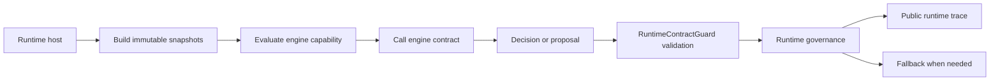

# AirMeta.SelfWeave.Runtime 运行时契约总览

`AirMeta.SelfWeave.Runtime` 是 SelfWeave 系统对外暴露的公共运行时契约类库。它的职责不是实现认知引擎，也不是承载 API、数据库或任务编排流程，而是定义运行时和引擎之间稳定、可审计、可版本化的交互边界。

该仓库适合作为开源或跨仓依赖使用。闭源认知引擎、社区引擎、企业 API 和运行时宿主都应该通过这里定义的 DTO、接口、能力声明、治理标记和追踪记录进行交互。

## 设计目标

- 固定运行时与引擎之间的调用契约。
- 让引擎只能返回决策或建议，不能直接修改运行时稳定状态。
- 让运行时保持治理、审计、降级、权限和生命周期的最终所有权。
- 让闭源引擎可以被替换、包裹或降级，而不暴露内部参数、权重、样本和算法实现。
- 让社区引擎可以实现相同接口，作为可公开审查的基线实现或 fallback。

## 仓库边界

本仓库包含：

- 运行时契约接口。
- 不可变快照 DTO。
- 引擎决策和建议 DTO。
- 引擎能力声明与兼容性结果。
- 治理标记和治理结果。
- 公开审计追踪记录。
- 插件清单和插件握手契约。
- 契约序列化、依赖边界和安全排除校验。

本仓库不包含：

- 运行时宿主实现。
- API Controller、应用服务、仓储、数据库上下文。
- Air.Cloud 载体工作流。
- 引擎内部计算逻辑。
- 私有参数、权重、阈值、样本、训练数据、私有 trace 或密钥。
- 稳定图谱写入逻辑。

## 核心原则

### Runtime owns governance

运行时是治理所有者。引擎可以返回 `Decision` 或 `Proposal`，但不能声明治理已经完成，也不能声明稳定图谱已经写入。

任何涉及长期状态、高风险动作、稳定神经元、稳定突触或人工确认的输出，都必须由运行时进行治理审核。

### Engines are replaceable

引擎实现可以是闭源 Cognitive Engine，也可以是 Community Engine，还可以是远程插件或进程外适配器。只要实现同一组接口并通过能力兼容性检查，运行时就可以按统一流程调用。

### Snapshots are immutable inputs

引擎输入必须是运行时构建的不可变快照。快照只携带公开引用、摘要、版本、来源和哈希，不携带可执行句柄、数据库连接、运行时上下文对象或可变状态。

### Output is reviewable

引擎输出必须可序列化、可审计、可解释。输出应包含身份、版本、输入快照哈希、原因码、置信度和治理标记。输出不能包含绕过治理、已持久化、已执行、已修改稳定状态等声明。

## 目录结构

```text
AirMeta.SelfWeave.Runtime
├─ src/
│  └─ AirMeta.SelfWeave.Runtime/
│     ├─ AirMeta.SelfWeave.Runtime.csproj
│     └─ Contracts/
│        ├─ Abstractions/
│        ├─ Capabilities/
│        ├─ Decisions/
│        ├─ Governance/
│        ├─ Plugins/
│        ├─ Snapshots/
│        ├─ Tracing/
│        ├─ Validation/
│        └─ Versioning/
├─ tests/
│  └─ AirMeta.SelfWeave.Runtime.Tests/
└─ docs/
```

`Contracts` 目录先按契约职责分层，再保持一个公开类型一个文件，方便跨仓引用方查找类型、审查变更和生成 API 文档。

目录职责：

- `Abstractions`：运行时调用引擎的接口和契约类型枚举。
- `Capabilities`：引擎能力声明、兼容性结果、兼容性评估和披露/确定性枚举。
- `Snapshots`：运行时构造并传给引擎的不可变输入快照。
- `Decisions`：引擎返回的决策和建议 DTO。
- `Governance`：治理标记、治理结果和治理状态枚举。
- `Tracing`：公开审计追踪记录。
- `Plugins`：插件清单、插件握手和插件隔离等级。
- `Validation`：契约输出、依赖边界和序列化校验。
- `Versioning`：契约版本和运行时契约身份。

## 调用链位置

典型调用链如下：



该链路中只有接口和 DTO 属于本仓库。运行时宿主、治理策略实现、数据库写入和 API 暴露都在本仓库之外。

## 版本策略

当前初始契约版本为：

```csharp
RuntimeContractVersions.Initial = "runtime-contract/1.0"
```

版本演进应遵守：

- 只新增可选字段时，可以保持兼容版本或增加小版本说明。
- 删除字段、改变字段语义、改变默认治理行为时，必须升级契约版本。
- 引擎能力声明必须显式报告支持的快照版本和决策版本。
- 运行时必须在调用引擎前执行兼容性评估。
